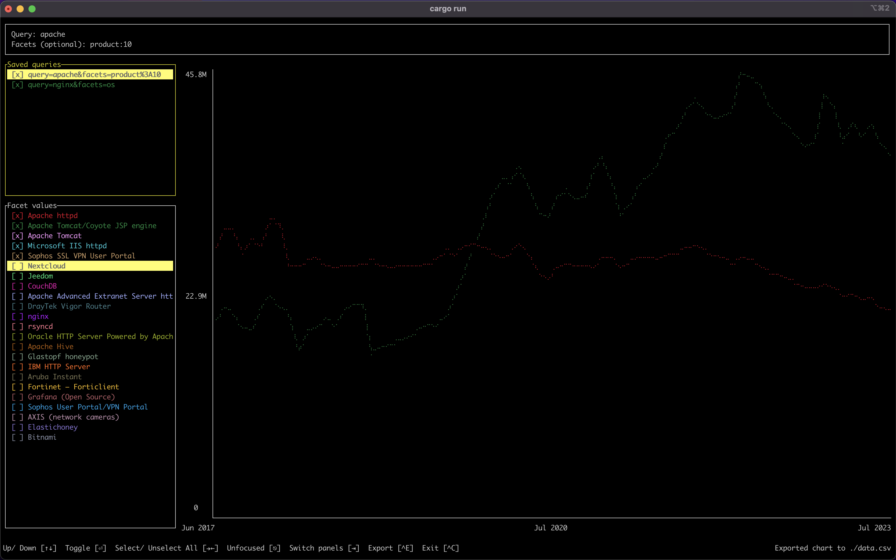

# Shodan Trends TUI

[](https://crates.io/crates/strend)
[](./LICENSE)
[](https://twitter.com/shodanhq)

## Search and visualize Shodan historical data in the terminal.

`strend` fetches data via the [Shodan Trends](https://trends.shodan.io) API, please check [docs](https://developer.shodan.io/api/trends) for more information.



## Installation

Grab the [latest binary](https://github.com/thoongnv/trends-rs/releases) for your operating system

### Rust Package Registry

```bash
cargo install strend
```

### Homebrew (macOS)
```bash
brew tap thoongnv/homebrew-strend https://github.com/thoongnv/homebrew-strend
brew install strend
```

> Waiting for reconsider: https://github.com/Homebrew/homebrew-core/pull/140247

## Usage

The `strend` command can be launched with or without query.

```bash
strend
strend --query "product:nginx port:443" --facets country:10
strend --help
Search and visualize Shodan historical data in the terminal.

Usage: strend [OPTIONS] [COMMAND]

Commands:
  init  Initialize Shodan API key, grab it from https://account.shodan.io
  help  Print this message or the help of the given subcommand(s)

Options:
      --query <QUERY>    Search query used to search the historical database, e.g. "product:nginx port:443"
      --facets <FACETS>  A comma-separated list of properties to get summary information on, e.g. country:10
  -h, --help             Print help
  -V, --version          Print version
```

## Debugging

Our application rendered to `stderr`, so we could use `println!("dump variable: {:?}", variable);` in code and then pine the output to a log file.

```bash
cargo run > debug.log
tail -f debug.log
```
