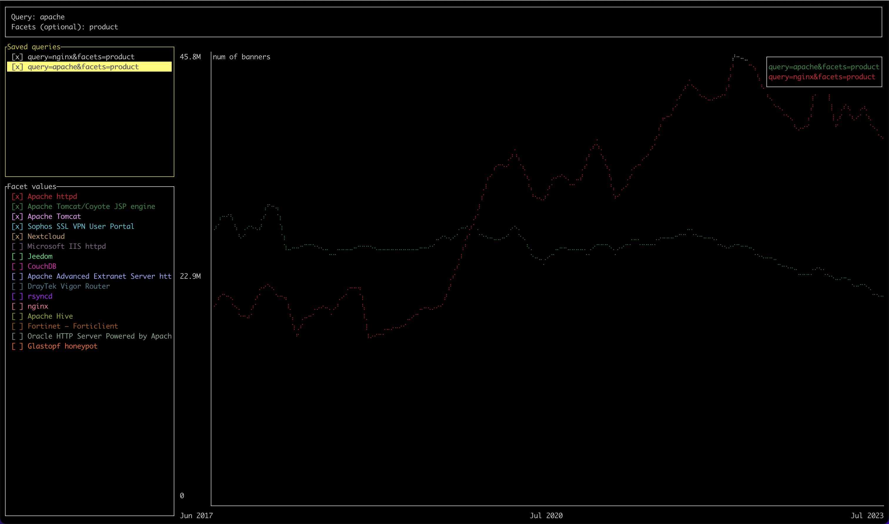

# Shodan Trends TUI

[](https://crates.io/crates/strend)
[](./LICENSE)
[](https://twitter.com/shodanhq)

## Search and visualize Shodan historical data in the terminal.

``strend`` fetches data via the [Shodan Trends API](https://trends.shodan.io/api/v1/search?query=&facets=&key=), please check [docs](https://developer.shodan.io/api/trends) for more information.



## Installation

Grab the [latest release](https://github.com/thoongnv/trends-rs/releases) for your operating system or install it from [crates.io](https://crates.io).

```shell
cargo install strend
```

## Usage

The ``strend`` command can be launched with or without query.

```shell
$ strend --help
Search and visualize Shodan historical data in the terminal.

Usage: strend [OPTIONS]

Options:
      --query <QUERY>    Search query used to search the historical database, e.g. "product:nginx port:443"
      --facets <FACETS>  A comma-separated list of properties to get summary information on, e.g. country:10
  -h, --help             Print help
```